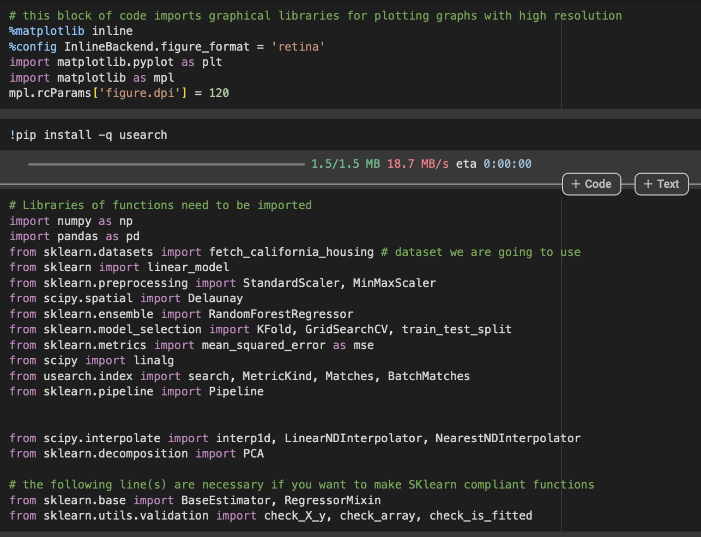
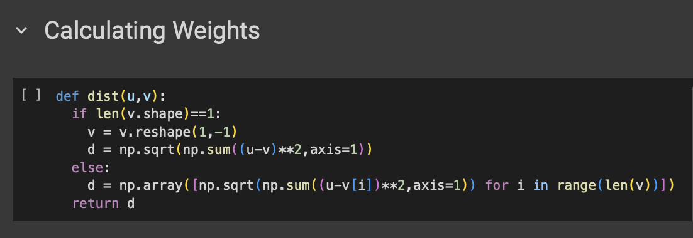

# HW1 - GitHub Page and Locally Weighted Regression Experiment
### Andrew Choi
### DATA 440 Capstone Projects

# Creating a locally weighted regression class for housing dataset report

## Importing and Downloading all Libraries:

The screenshot below is going to show all of the libraries and kernel functions that are needed for this project

There are lot of libraries here that we used from class, but is important to recognize some of the libraries that were not used during class. Some of those include the library to download the California Data Set that was used for this project as well as the Pipeline class that was used to apply Grid Search below. 

## Fetching the Data to Use:

The screenshot below is going to establish the data and take a random sample of the large dataset for the sake of time.

After declaring the California housing dataset, I continued to explore the characteristics of the dataset and then establish the x and y variables here. 

## Preparing features correctly 

The screenshot here is looking preparing the features as well as defining the kernels that we possibly use for the locally weighted regression.

## Defining the weights function

In the screenshot below the goal of the code block is to derive the weights from the training data that is essential for solving locally weighted regression.

The goal of this function is to help with calculating the Euclidean distances between two points and then calculating the weights based on the distances of the points. This is important and needed as it helps with the model where it fits around each of the points. 

## Locally Weighted Regression Class Making

In the screen shots below I declared the locally weighted regression classes that are similar to the ones we discussed in class. There were a few tweeks that were made in order to help the targeting of the project to the California Housing data set. 

Based on the results of the 10-fold cross-validated mean square error, the results show a result that has the Random Forest to have a higher MSE error value. The locally weighted regression class function goes to calculate the distances between the data points in order to find the weights using the Tricubic kernel. Since this data set has more than one feature, we place an importance on using PCA in order to reduce to the proper dimensionality that we need. After processing the classes that we need we then move forward to the cross-validation. It was made sure that the x values used were standardized in order for proper analysis (as the weights may have contributed to possible noise in the project)

## Applying Grid Search

In the screenshot below I tried to run some code, similarly done in class, on finding the best hyperparameters that may not only increase the score but find a better and more reliable one.

What is important to know from these steps is that the goal is to fine tune the model. Finding the best hyperparameters will not only increase the reliability of the model, but also the strength of the answer as well. Being able to pick the best configurations for the model gives me the leeway to know that the model already accounted for the possible wide range of possibilities. 

## Moving on and Residual Analysis

In the screenshot below I performed residual analysis on the results

After fitting the model, I went on to perform a residual analysis. This is important as it helps with determining whether or not the residuals are behaving properly. Based on the results of this analysis, it shows that many of the points are along the zero residual line, which means model is performing quite well for the predicted values. There is a slight pattern on the residuals graph and so that could mean something is important to take into account

## The Future of the Project

This project does a great job in performing and showing off the great capabilities of using a locally residual analysis model. One of the small takeaways that had to be done was using a random sample of the dataset as well as partially analyzing such graphs and reports. If I were to continue with this project I would want to test the model on a larger portion of the dataset, eventually the whole thing, as well as going beyond the creating of the graphs. 

